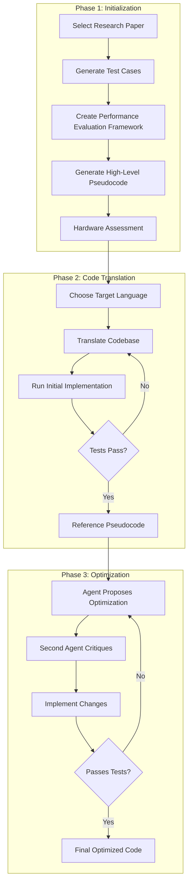
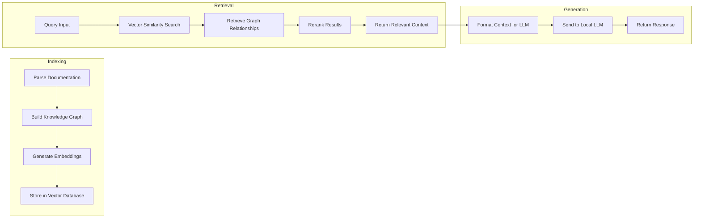
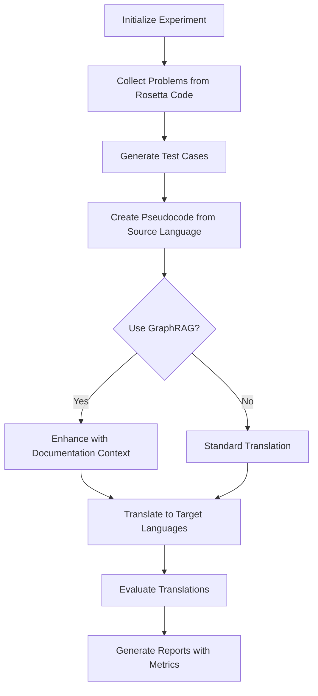

```mermaid
flowchart TD
    subgraph "Phase 1: Initialization"
        A[Select Research Paper] --> B[Generate Test Cases]
        B --> C[Create Performance Evaluation Framework]
        C --> D[Generate High-Level Pseudocode]
        D --> E[Hardware Assessment]
    end
    
    subgraph "Phase 2: Code Translation"
        E --> F[Choose Target Language]
        F --> G[Translate Codebase]
        G --> H[Run Initial Implementation]
        H --> I{Tests Pass?}
        I -->|No| G
        I -->|Yes| J
    end
    
    subgraph "Phase 3: Optimization"
        J[Reference Pseudocode] --> K[Agent Proposes Optimization]
        K --> L[Second Agent Critiques]
        L --> M[Implement Changes]
        M --> N{Passes Tests?}
        N -->|No| K
        N -->|Yes| O[Final Optimized Code]
    end
```

```mermaid
flowchart LR
    subgraph "Indexing"
        A[Parse Documentation] --> B[Build Knowledge Graph]
        B --> C[Generate Embeddings]
        C --> D[Store in Vector Database]
    end
    
    subgraph "Retrieval"
        E[Query Input] --> F[Vector Similarity Search]
        F --> G[Retrieve Graph Relationships]
        G --> H[Rerank Results]
        H --> I[Return Relevant Context]
    end
    
    subgraph "Generation"
        I --> J[Format Context for LLM]
        J --> K[Send to Local LLM]
        K --> L[Return Response]
    end
```

```mermaid
flowchart TD
    A[Initialize Experiment] --> B[Collect Problems from Rosetta Code]
    B --> C[Generate Test Cases]
    C --> D[Create Pseudocode from Source Language]
    D --> E{Use GraphRAG?}
    E -->|Yes| F[Enhance with Documentation Context]
    E -->|No| G[Standard Translation]
    F --> H[Translate to Target Languages]
    G --> H
    H --> I[Evaluate Translations]
    I --> J[Generate Reports with Metrics]
```